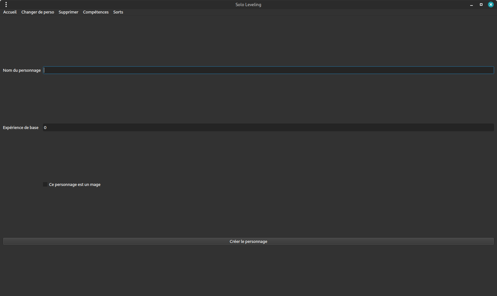
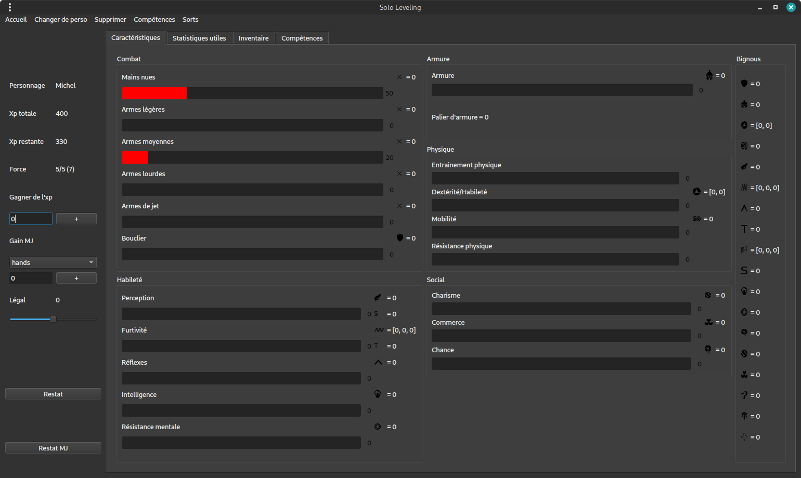
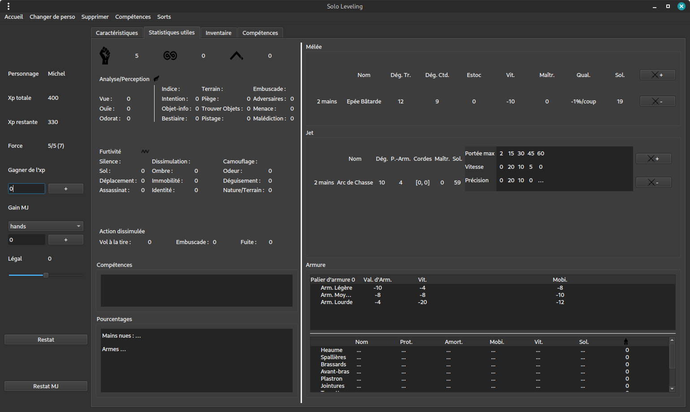
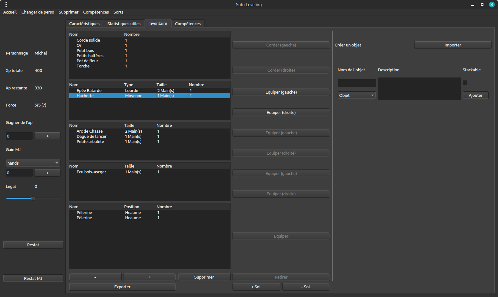
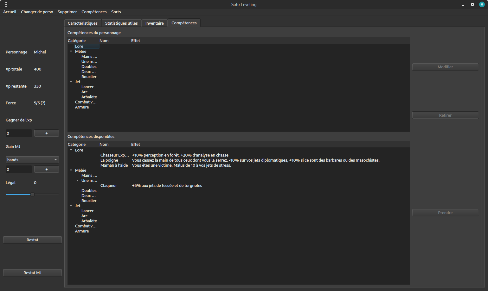
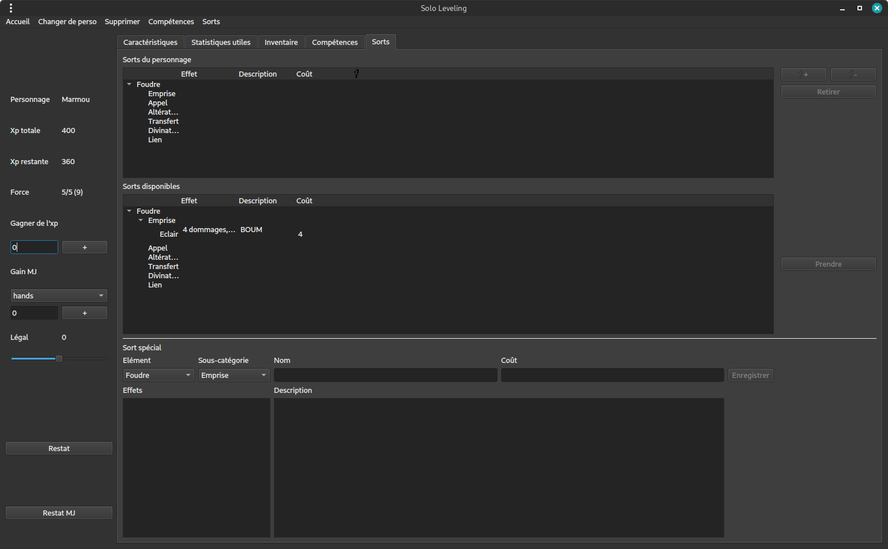
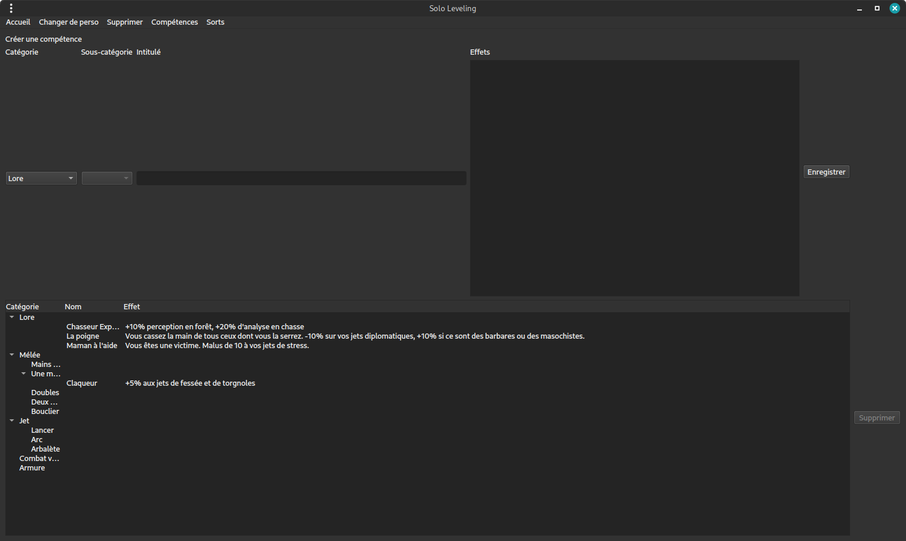
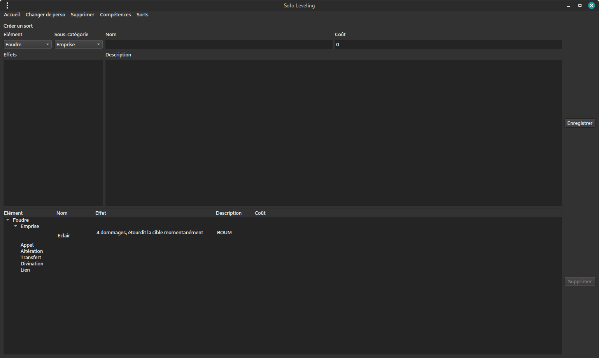

# RPG_CharacSheet

RPG_CharacSheet is a UI made to handle more easily the character sheets of a Role Playing Game with specific rules that a friend created. Current stable version is made with Qt for Python.

This program includes:

- an easy way to create a new character
<html>
    
</html>

- an intuitive user interface to visualize all the experience points spent and left to spend
<html>
    
</html>

- a tab summing up all the necessary statistics for the game itself
<html>
    
</html>

- an Inventory tab to manage the character's inventory
<html>
    
</html>

- an Abilities tab to manage the character's non-magical abilities
<html>
    
</html>

- a Spells tab to manage the character's magical abilities if this character is a mage
<html>
    
</html>

- a more general view to create abilities available to all characters
<html>
    
</html>

- a more general view to create spells available to all mage characters
<html>
    
</html>
